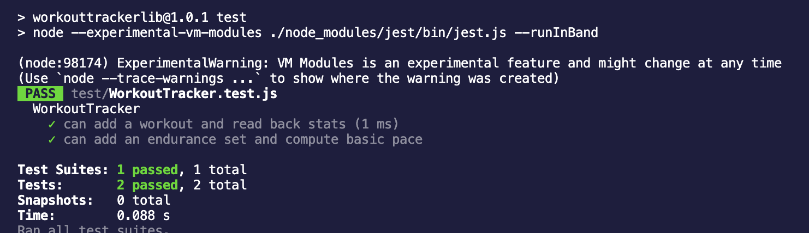
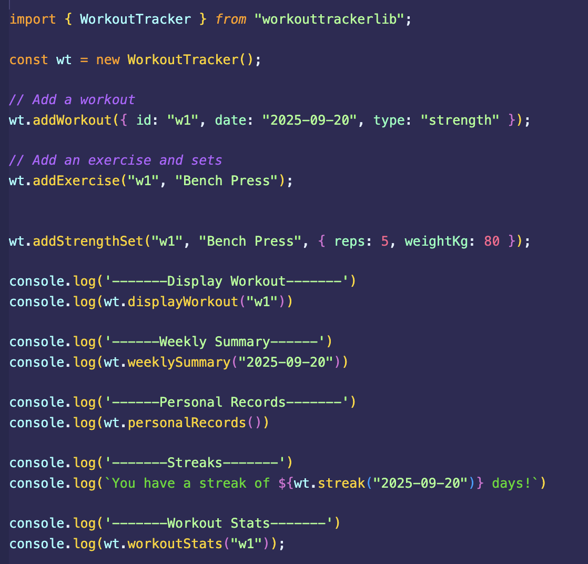
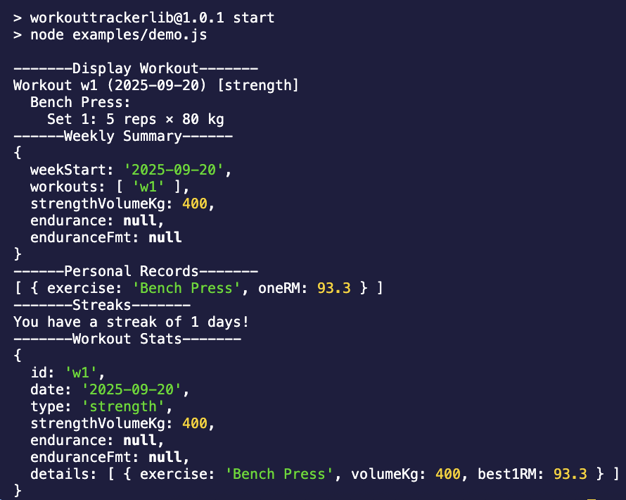

# Test Report

**Strategy**  
1. I tested with a demo app (`examples/demo.js`) to check all features manually.  
2. I wrote two Jest tests (`tests/WorkoutTracker.test.js`) to check strength and endurance.  

**Environment**  
- Node.js v20  
- Jest v29  

---

## Test Cases (Jest)

---

## Manual Checks (demo app)
The manual test can be found in examples/demo.js, starting at line 81.
Above that, there are several manual tests that check multiple days at once. Including all of them here would be too much, so if you want a more detailed view, please look there for the full examples.

Below, we show some of the main methods that you can use in your own tests or applications.

Here is the output from the test
 

---

## Summary
The two Jest tests confirm the most important cases (strength and endurance). The demo app checked the other functions. All results were correct, and validation worked as expected. The library behaves as intended.
